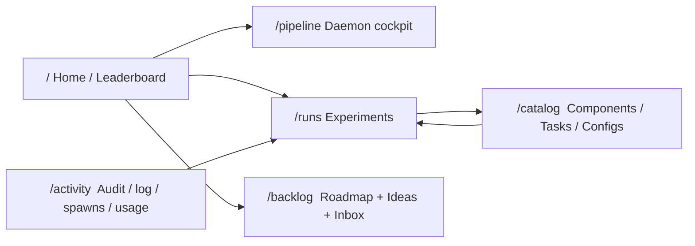
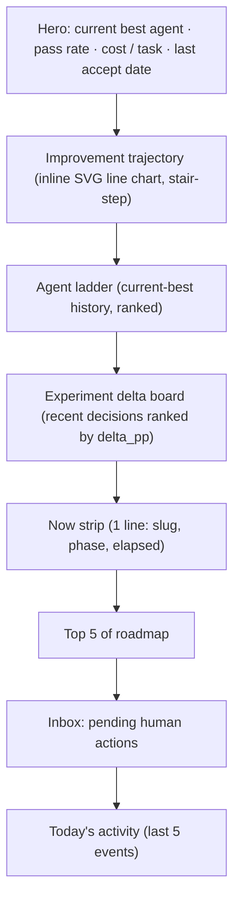
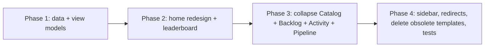

## Lab Web Redesign

### Why a redesign

The current IA carries large duplication:

- **Decisions/verdicts** appear on `/`, `/tree`, `/runs`, and `/runs/{id}` with overlapping framing.
- **Roadmap** appears compacted on `/`, fully on `/roadmap`, and partly on `/pending` and `/`'s "You owe".
- **Daemon status** appears on `/` (Now), `/daemon` (cockpit), and at the top of `/log`.
- **Components/tasks** are split across 5 routes (`/components`, `/components-perf`, `/components/{id}`, `/tasks`, `/tasks/{id}`) with overlapping perf surfaces.
- **Ideas vs Roadmap** are conceptually one backlog split into two pages.
- **Activity-log-shaped tables** live on four separate pages: `/log`, `/audit`, `/spawns`, `/usage`.

There is **no agent leaderboard**, no improvement-over-time chart, and no decision lane that visualizes which experiments caused the current best to change.

### New IA (6 pages)

| New route | Replaces | What it owns |
|---|---|---|
| `/` | `/` (status) | Hero, trajectory chart, agent ladder, experiment delta board, "Now" strip, top-5 of roadmap, inbox, today's activity |
| `/pipeline` | `/daemon` | Control bar, 7-phase strip, history, diagnostics disclosure |
| `/runs`, `/runs/{id}`, `/runs/{id}/trials/{trial_id}` | `/runs`, `/experiments` | Filterable run list, run detail (legs, heatmap, decision panel, comparisons, cluster Δ, critic md, summary md), trial drilldown |
| `/catalog` with tabs `components`, `tasks`, `configs`; `/catalog/components/{id}`, `/catalog/tasks/{checksum}` | `/components`, `/components-perf`, `/components/{id}`, `/tasks`, `/tasks/{checksum}`, `/tree` | Components list+matrix+detail; tasks list+leaderboard; configuration state (current best, rejected, proposed) + decision history |
| `/backlog` with sections `queue`, `suggested`, `ideas`, `done`, `inbox` | `/roadmap`, `/ideas`, `/pending` | One backlog page; promote/demote/discard inline |
| `/activity` with kind filter (`cmd`, `tick`, `spawn`, `verdict`, `current-best`, `usage`) | `/log`, `/audit`, `/spawns`, `/usage` | Unified timeline; usage summary as a sticky header strip |

Old routes are **not** retained as compatibility aliases in the final state. During implementation they may exist temporarily, but Phase 4 deletes the old route handlers and templates so the codebase has one canonical IA. The legacy "More views" disclosure is dropped from the sidebar.

### The leaderboard surface (the new `/` page)

- **Hero**: `snapshot.current_best_id`, `snapshot.current_best_anchor`, plus the live pass rate of the most-recently-accepted leg pinned to that id and its cost-per-task.
- **Improvement trajectory**: stair-step SVG. X = decision timestamp, Y = pass-rate of the candidate leg at the accepted experiment. Each step = one `accept` decision. Tooltip: slug, instance_id, rationale, Δpp from prior.
- **Agent ladder** (top half of the leaderboard): one row per `current_best_changes.to_id` (i.e., every config that was ever accepted as the current best), ranked by its accepted-leg pass rate where available. Status pill: `current best`, `superseded`. Click → `/runs/{id}` of the accepting experiment.
- **Experiment delta board** (bottom half): every `decisions` row, ranked by known Δpp (positive at top), with verdict pill. Shows `accept`, `reject`, and `no_op` decisions so the operator sees the full search front, not just successes. Delta is nullable when the critic decision cannot be mapped to a simple baseline/candidate leg pair; the UI must show that explicitly rather than recreating deterministic threshold verdicting.
- **Now**, **Top 5 of roadmap**, **Inbox**, **Today's activity** stay as compact strips so the page narrates "score → trajectory → what's running → what's next" without context switches.

Implementation notes for the chart: plain inline SVG (Tailwind already loaded, no new CDN deps). About 60 lines of Jinja with a Python helper that converts trajectory points into `(x, y)` pixel coords. No JS framework introduced.

### Concrete file changes

Data layer ([src/openharness/lab/web/data.py](src/openharness/lab/web/data.py), [src/openharness/lab/web/models.py](src/openharness/lab/web/models.py)):

- Add view models: `AgentLadderRow`, `ExperimentDeltaRow`, `ImprovementPoint`, `LeaderboardView` (bundles all three plus current-best snapshot).
- Add `LabReader` methods:
  - `agent_ladder()` — joins `current_best_changes` × `decisions` × `legs` × `trials` × `experiments` to compute per-agent accepted pass rate, accepted_at, accepting instance_id, status.
  - `experiment_delta_board(limit=50)` — joins `decisions` × leg/trial aggregates to compute Δpp per decision where the baseline/candidate legs can be inferred, ordered by known Δpp DESC and then decision time DESC.
  - `improvement_trajectory()` — same shape as `agent_ladder` but ordered by `at_ts` ASC and including only accepting/current-best events; ready-for-chart.
  - `leaderboard()` — bundles the three leaderboard slices plus the current-best snapshot.
  - Reuse existing `activity_log(kinds=..., limit=...)` for `/activity`; do not introduce a second legacy wrapper.

Routing + templates ([src/openharness/lab/web/app.py](src/openharness/lab/web/app.py)):

- Replace `home()` body with leaderboard render. Split rendering into HTMX partials (`_hx/leaderboard-trajectory`, `_hx/leaderboard-ladder`, `_hx/leaderboard-delta`) so each refreshes independently.
- Add `/pipeline`, `/catalog`, `/catalog/components/{id}`, `/catalog/tasks/{checksum}`, `/backlog`, `/activity` routes. Reuse existing data methods.
- Delete old route handlers after the replacement pages land: `/tree`, `/components`, `/components-perf`, `/components/{id}`, `/tasks`, `/tasks/{c}`, `/ideas`, `/roadmap`, `/pending`, `/daemon`, `/log`, `/audit`, `/spawns`, `/usage`, `/experiments`, and `/experiments/{id}`. Keep `/runs` and `/runs/{id}` as canonical.

New templates:

- `home.html` — leaderboard composition (replaces the 5-zone status board).
- `_leaderboard_hero.html`, `_leaderboard_trajectory.html` (the SVG chart), `_leaderboard_ladder.html`, `_leaderboard_delta.html` partials.
- `pipeline.html` — migrated from the former daemon cockpit, with no functional change beyond the path/title.
- `catalog.html` with tab routing using `?tab=…` (server-side render of one tab body per request to keep partials reusable). The three tab-bodies factor out the existing `_components_body.html`, the existing tasks list table, and the former config-state sections.
- `backlog.html` — single page that reuses `_roadmap_body.html`, `_ideas_body.html`, and the `_pending_body.html` content under one heading hierarchy.
- `activity.html` — single page that consumes the existing activity log reader with kind/actor/slug filters and a usage summary header.

Sidebar:

- Rewrite [src/openharness/lab/web/templates/_sidebar.html](src/openharness/lab/web/templates/_sidebar.html) to six items (Home, Pipeline, Runs, Catalog, Backlog, Activity). Drop "More views" disclosure entirely.

Templates to delete (after the new pages cover their content):

- `tree.html`, `components.html`, `components_perf.html`, `component_detail.html`, `tasks_list.html`, `task_detail.html`, `roadmap.html`, `ideas.html`, `pending.html`, `spawns.html`, `usage.html`, `audit.html`, `daemon.html`, `experiments_list.html`, `log.html`, `experiment_detail.html` (renamed to `run_detail.html`), `_idle_reason.html`, `_drawer.html`, `_home_daemon.html` if unused after collapse. Keep partials still used by reused content (e.g., `_daemon_pipeline.html`, `_daemon_history.html`, `_status_roadmap_queue.html`, `_you_owe.html`, `_pr_badge.html`, `_decision_preview.html`).

Tests:

- Update fixtures + assertions in `tests/test_lab/test_web_*.py` to follow the renamed routes. Add smoke tests for `/`, `/catalog?tab=…`, `/backlog`, `/activity?kind=…`, plus a render test for `_leaderboard_trajectory.html` against a synthetic three-accept history. Update `tests/test_lab/test_daemon_state.py` for `/pipeline`.

### Phasing (one PR per phase, each independently shippable)

- **Phase 1** is purely additive (new methods + view models); existing UI keeps working.
- **Phase 2** ships the leaderboard at `/` while the old pages all still resolve.
- **Phase 3** introduces the four collapsed pages. Old pages still resolve so feedback can shape the new ones before deletion.
- **Phase 4** deletes obsolete route handlers/templates, rewrites the sidebar, and brings tests in line.

### Open considerations (not blocking the plan, will resolve during phase 1 review)

- Trajectory chart uses pass-rate of the candidate leg at acceptance time. If pass rate becomes ambiguous when an experiment evaluates against multiple benchmarks (Harbor + TermBench 2), we will plot the aggregate first and add a per-benchmark toggle as a follow-up rather than blocking phase 2 on it.
- The agent ladder ranks accepted configs only. A "challengers" disclosure (configs that were proposed but never accepted) can be added later if the operator needs it; not in the initial cut.
