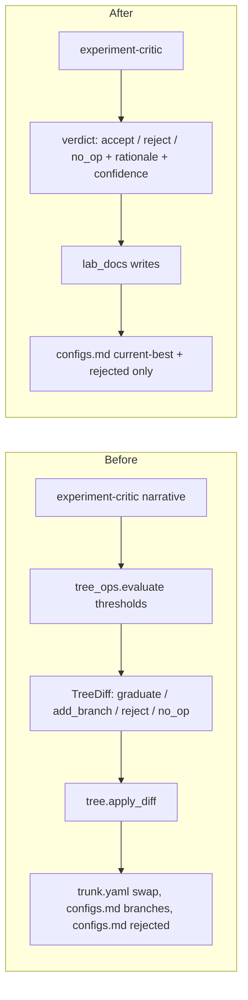

# Simplify the autonomous lab pipeline

## Goal restatement

The lab finds **generalizable agent-system improvements**. TB2/Harbor are *measurement instruments*, not the optimization target. Methodology should be guidance, not contract.

## Architecture diff



## What we delete

### Skills (whole directories)
- [.agents/skills/lab-run-experiment/](.agents/skills/lab-run-experiment/) — already deprecated, replaced by `phase_run.py`
- [.agents/skills/lab-reflect-and-plan/](.agents/skills/lab-reflect-and-plan/) — replaced by `lab-replan-roadmap`
- [.agents/skills/lab-graduate-component/](.agents/skills/lab-graduate-component/) — legacy escape hatch; finalize handles graduation

### Source code
- [src/openharness/agents/configs/trunk.yaml](src/openharness/agents/configs/trunk.yaml) — drop the file. Experiment specs in `experiments/*.yaml` declare which agent is their baseline; there's no global trunk YAML to swap.
- [src/openharness/lab/tree_ops.py](src/openharness/lab/tree_ops.py) — drop `_classify_pair`, the threshold constants (`MIN_TRIALS_PER_LEG_FOR_VERDICT`, `SMALLEST_MEANINGFUL_EFFECT_PP`, etc.), and `evaluate()`. Keep `LegStats` / leg-stats query helpers because experiment-critic still wants pre-computed aggregates.
- [src/openharness/lab/tree.py](src/openharness/lab/tree.py) — drop the entire `apply_diff`. Replace with a much smaller `apply_decision(slug, decision)` that:
  - on `accept`: calls `lab_docs.set_current_best(target_id, …)`
  - on `reject`: calls `lab_docs.add_rejected(...)`
  - on `no_op`: writes nothing to configs.md
  - in all cases: writes the verdict block into the journal entry
- [src/openharness/lab/lab_docs.py](src/openharness/lab/lab_docs.py) — drop `add_branch()`. Rename `set_trunk()` to `set_current_best()`. Drop the `## Branches` rendering helpers.
- [src/openharness/lab/cli.py](src/openharness/lab/cli.py) — drop `lab graduate confirm`, `lab tree apply` (or rename the latter to `lab decision apply` for manual recompute).
- [src/openharness/lab/migrations/](src/openharness/lab/migrations/) — leave existing tables in place (don't break old data); add a small migration that adds `decision` (text) and `confidence` (real) columns to `tree_diffs`, repurposing the table as `decisions`.

### Documentation surfaces
- `lab/configs.md > ## Branches` section — remove entirely. Move `planner_executor` and `react` to `## Rejected` with their evidence link (re-add as `## Proposed` later if anyone wants to retest).
- `lab/components.md` — drop the `branch` status value; use `validated / experimental / rejected / proposed / deferred` only.
- `lab/METHODOLOGY.md` — full rewrite (see below).

## What we rewrite

### lab/METHODOLOGY.md (full rewrite, no numbered sections)

Anchored on the *goal*, not on rules. Sections:

- **Mission** — find generalizable agent-system improvements; benchmarks are measurement instruments.
- **What "generalizable" means** — runtime policy should ideally use only what's available on an unseen task (instruction, workspace, tools, observations). Treat this as a *quality criterion* skills apply during design and replan, not a hard gate at verdict time. Prior runtime-admissibility prose moves here as guidance.
- **Verdicts** — `accept / reject / no_op`, with one paragraph each. Verdicts are produced by `experiment-critic` as a structured recommendation; humans/replan can override on review.
- **Evidence shape** — guidance on slice, legs, repetitions, controls. No verdict-determining thresholds.
- **Anti-patterns** — same list as today, framed as guidance, not enforcement.

No `§N` numbering anywhere — refs from code/skills become plain prose links.

### lab/README.md and lab/OPERATIONS.md

- Verdict table collapses to 3 outcomes.
- Drop branches column from file-ownership table.
- Drop "graduate confirm" mentions entirely.

### .agents/skills/experiment-critic/SKILL.md (substantial rewrite)

Becomes the sole verdict authority. Output schema gains:

```json
{
  "verdict": "accept | reject | no_op",
  "rationale": "...",
  "confidence": 0.0,
  "promotability_notes": "..."
}
```

Schema in [schemas/skills/experiment-critic.json](schemas/skills/experiment-critic.json) (new or updated) constrains the final assistant message.

### .agents/skills/lab-finalize-pr/SKILL.md

- Merge rules: `accept` → merge code + lab/, `reject`/`no_op` → metadata-only merge.
- Drop add_branch/graduate distinctions and any references to trunk.yaml swaps.

### .agents/skills/lab-replan-roadmap/SKILL.md

- Read the new 3-verdict surface.
- Drop METHODOLOGY §-references (will become plain prose).

### .agents/skills/lab-design-variant/SKILL.md and lab-implement-variant/SKILL.md

- Drop METHODOLOGY §N citations.
- Drop add_branch/graduate vocabulary.

### .agents/skills/lab/SKILL.md (router)

- Drop legacy mentions (`lab-reflect-and-plan`, `lab-graduate-component`).
- Update verdict description to 3 labels.

### Misc consistency fixes (incidental)

- [src/openharness/lab/phase_state.py](src/openharness/lab/phase_state.py) lines 18-21 — fix the docstring contradiction (failures *are* sticky across retries; only `mark_ok` / `reset_phase` clear them).
- [src/openharness/lab/phase_run.py](src/openharness/lab/phase_run.py) docstring — drop the "implements lab-run-experiment" wording; describe its actual role.
- All `METHODOLOGY.md §N` references in `tree_ops.py`, `lab-implement-variant/SKILL.md`, `web/data.py`, `cli.py` either disappear (when METHODOLOGY drops numbering) or become plain prose.

## Order of operations

To keep the daemon runnable at every commit, this is sequenced so each commit is shippable:

1. **Verdict surface migration**: extend `experiment-critic` output schema with `verdict / rationale / confidence`. Make `runner.py` critique phase prefer the new field, falling back to `tree_ops.evaluate` when absent. Tests pass under both worlds.
2. **Drop deterministic verdict**: delete `tree_ops._classify_pair`, `evaluate()`, threshold constants, and the runtime-admissibility guard. Critique phase now requires the structured experiment-critic output. Update `tests/test_lab/test_tree_ops.py` accordingly.
3. **Collapse verdict labels**: rename `graduate` → `accept`. Treat any historical `add_branch` rows as informational only (existing journal entries stay as-is). Drop `add_branch` from `TreeDiff`/`Decision` enums.
4. **Drop trunk.yaml**: delete the file, drop `_trunk_yaml`/`_agent_configs_dir` helpers in `tree.py`, drop the `graduate` yaml-swap path. Reanchor `lab/configs.md > ## Trunk` as `## Current best` (markdown-only pointer; no source-file binding).
5. **Drop branches**: remove `lab_docs.add_branch`, the `## Branches` section parser/writer, the renderer in `web/data.py`, and the column in OPERATIONS.md. Move existing `planner_executor`/`react` rows to `## Rejected` with a `revisit-as-proposed` note.
6. **Delete deprecated skills**: remove the three SKILL.md directories and any references in `lab/SKILL.md`, `codex.py` `SKILL_PROFILES` comments, and tests.
7. **Rewrite docs**: full pass on `METHODOLOGY.md`, `README.md`, `OPERATIONS.md`, plus the per-phase SKILL.md updates noted above.
8. **Consistency cleanup**: `phase_state.py` and `phase_run.py` docstrings; sweep for any remaining `METHODOLOGY.md §N` strings; sweep tests.

## What stays exactly as-is

- 7-phase pipeline, branched experiments, finalize-merges-back-to-main pattern.
- Per-slug `phases.json` resumability.
- Codex/Gemini critic split and `SKILL_PROFILES` (minus deleted skills).
- Markdown state files structure (`configs.md`, `experiments.md`, `roadmap.md`, `ideas.md`, `components.md`).
- DuckDB tables for trials, critiques, task_features, components_perf.
- Repair budget mechanism (just fix the docstring).

## Out of scope (not part of this simplification)

- Replacing the branched-experiment + finalize-PR pattern with direct-to-main. The branched flow is the audit story, not the strict-verdict story.
- Touching the trial-critic / experiment-critic / cross-experiment-critic decomposition. Only the verdict-output of `experiment-critic` changes shape.
- Rebuilding the web UI. Verdict-table rendering will pick up the new label set; no other UI changes planned.

## Open questions to validate before I start coding

- Where should the "current best" pointer live exactly: `lab/configs.md > ## Current best` (markdown-only), or in a tiny JSON like `lab/state/current_best.json`? Markdown is simpler; JSON is easier to read mechanically. Recommend markdown.
- Do you want existing journal entries with `Add branch` / `Graduate` verdicts left untouched (historical record), or rewritten to the new label set? Recommend leaving them untouched; the new contract starts from the next experiment.
