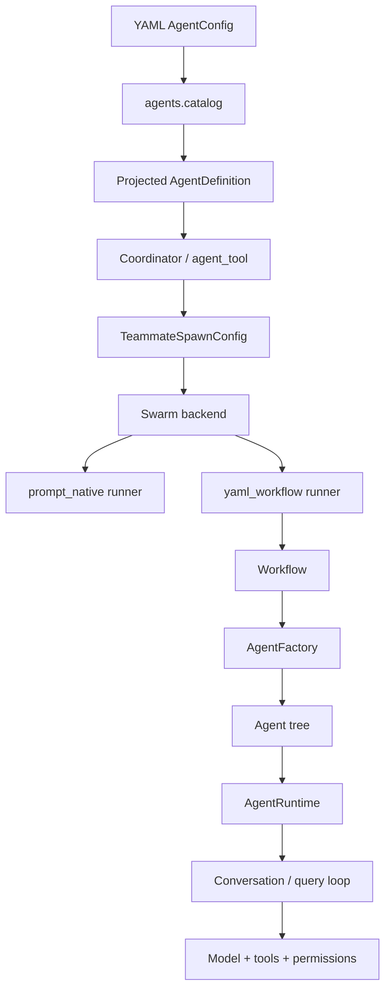
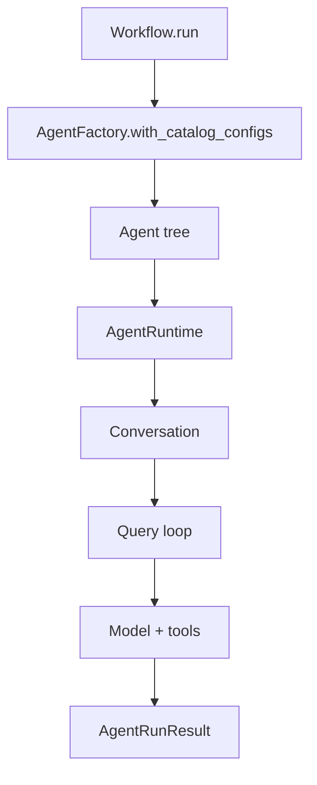
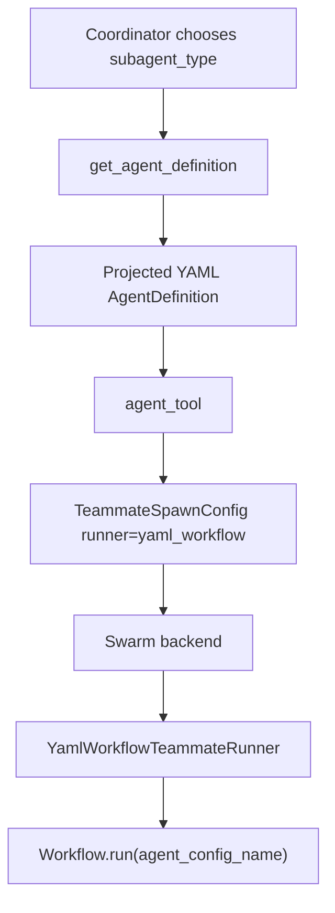
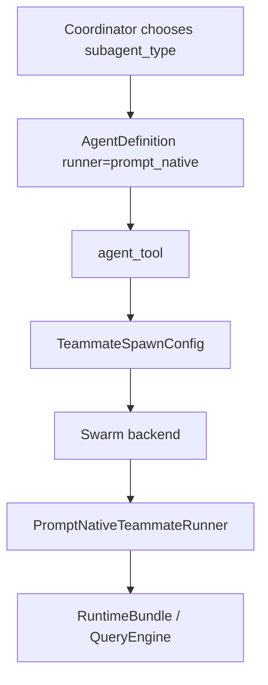

# Agent System

This document describes the current agent system after the upstream merge and the recent runtime and observability simplifications.

The core split is:

- Control plane: coordinator mode, `AgentDefinition`, `agent` / `send_message`, swarm backends, mailbox delivery, permission sync, and worktree-aware spawning.
- Execution plane: YAML `AgentConfig`, `AgentFactory`, `Workflow`, `AgentRuntime`, and the compositional architectures in `src/openharness/agents/architectures`.

The integration rule is simple:

- `AgentDefinition` decides how an agent is discovered and spawned.
- `AgentConfig` decides how a YAML-backed agent actually runs.
- `runner` connects the two.

See also `docs/fork-integration.md` for the fork-specific modules and their upstream integration points.

## Overview



There are three agent sources in the merged system:

1. Built-in prompt-native definitions from upstream.
2. YAML-backed agents projected into coordinator-visible definitions.
3. User or plugin definitions loaded directly as `AgentDefinition`.

Coordinator mode sees one merged catalog.

## Core Contracts

Everything builds on the small contract in `src/openharness/agents/contracts.py`:

```text
TaskDefinition          what to do
  instruction: str
  payload: dict

Agent (Protocol)        who does it
  run(task, runtime) -> AgentRunResult

AgentRunResult[T]       what came back
  output: T
  input_tokens: int
  output_tokens: int
  final_text -> str
```

This is deliberate. Any architecture can contain any other architecture as long as it implements `run(task, runtime)`.

## YAML Execution Model

`AgentConfig` in `src/openharness/agents/config.py` is the execution model for compositional agents. It describes:

- `architecture`
- model and turn limits
- tool set
- prompt templates
- nested `subagents`
- optional `definition` metadata for coordinator/swarm projection

Minimal example:

```yaml
name: default
architecture: simple
description: Default compositional coding agent.
model: gemini-2.5-flash-lite
max_turns: 15
max_tokens: 8192

definition:
  subagent_type: yaml-default
  description: Composable YAML coding agent.
  runner: yaml_workflow
  color: cyan

tools:
  - bash
  - read_file
  - write_file
  - edit_file
  - glob
  - grep
  - agent
  - send_message
  - task_stop

prompts:
  system: |
    {{ openharness_system_context }}
    You are a coding agent.
  user: |
    {{ instruction }}
```

`definition` is the bridge into the control plane. It supplies coordinator-visible metadata such as:

- `subagent_type`
- `description`
- `runner`
- `system_prompt` and `system_prompt_mode`
- `permission_mode`
- `tools` and `disallowed_tools`
- `skills`
- `required_mcp_servers`
- `initial_prompt`
- `isolation`

If `definition` is omitted, the system still projects the YAML config into an `AgentDefinition` using defaults derived from the config itself.

## Catalogs

The merged YAML catalog is loaded by `src/openharness/agents/catalog.py` from:

1. built-in configs in `src/openharness/agents/configs`
2. user configs in `~/.openharness/agent_configs`
3. project configs in `.openharness/agent_configs`

Override order is last-writer-wins by config name:

1. built-in
2. user
3. project

That same catalog is used by:

- `AgentFactory.with_catalog_configs(...)`
- `Workflow`
- YAML projection into coordinator definitions
- Harbor entrypoints

## Coordinator Catalog

`src/openharness/coordinator/agent_definitions.py` builds the public catalog used by coordinator mode and swarm spawning.

Merge order:

1. built-in prompt-native definitions
2. projected YAML definitions
3. user markdown definitions
4. plugin definitions

Important `AgentDefinition` fields:

- `name`
- `subagent_type`
- `runner`
- `agent_config_name`
- `agent_architecture`
- `system_prompt`
- `tools` and `disallowed_tools`
- `permission_mode`
- `plan_mode_required`
- `allow_permission_prompts`
- `isolation`

In practice, `subagent_type` is the stable routing key for coordinator mode.

## Execution Plane

### `AgentFactory`

`src/openharness/agents/factory.py` creates an agent tree from YAML config.

It maps `architecture` to concrete Python implementations:

- `simple`
- `planner_executor`
- `reflection`
- `react`

### `Workflow`

`src/openharness/runtime/workflow.py` is the top-level entrypoint for YAML-backed execution:

1. load the merged YAML catalog
2. create the requested agent tree
3. build `AgentRuntime`
4. run the agent
5. return `WorkflowResult`

### `AgentRuntime`

`src/openharness/runtime/session.py` is the execution substrate. It is responsible for:

- resolving settings and provider clients
- building the runtime system prompt
- constructing a tool registry
- enforcing permissions
- creating `Conversation`
- tracking usage
- writing JSONL logs
- exposing `run_agent_config(...)`

## Query Loop

The actual tool-aware loop lives in `src/openharness/engine/query.py`.

Important behavior:

- the system prompt is created once per agent run
- the initial user message is created once per agent run
- each provider call is still stateless, so the full conversation history is resent every turn
- tool outputs are appended as synthetic user-side messages containing `ToolResultBlock`

That last point is an internal normalization trick. Provider adapters translate it back into native wire formats:

- OpenAI adapter emits tool-role messages
- Codex adapter emits `function_call_output`
- Gemini adapter emits `function_response`

So the agent is autonomous in orchestration terms, but the provider still receives fresh requests with accumulated history on every turn.

## Tool Registries

There are two main tool-registry layers.

### Interactive registry

Interactive prompt-native sessions use the upstream-oriented registry in `src/openharness/tools/__init__.py`. It supports:

- allow and deny filtering
- MCP tools
- coordinator and swarm tools

### `WorkspaceToolRegistryFactory`

YAML execution uses `WorkspaceToolRegistryFactory` from `src/openharness/tools/__init__.py`. It supports:

- workspace tools such as `bash`, `read_file`, `write_file`, `glob`, and `grep`
- compatibility tools such as `agent`, `send_message`, and `task_stop`
- tool-name normalization for upstream aliases like `Read` and `Edit`

That means YAML agents can delegate through upstream swarm tools directly when they opt into them.

## Coordinator To Swarm Flow

The control-plane handoff is:

1. coordinator chooses an agent by `subagent_type`
2. `agent_tool` resolves the `AgentDefinition`
3. `agent_tool` maps it into `TeammateSpawnConfig`
4. the swarm registry selects a backend
5. the backend starts a stateful teammate runner

The mapping happens in `src/openharness/tools/agent_tool.py`.

## Runner Types

`src/openharness/swarm/runner.py` dispatches by `TeammateSpawnConfig.runner`.

### `prompt_native`

Used for built-in prompt-oriented workers.

Path:

1. build a `RuntimeBundle`
2. configure model, cwd, tools, and permission mode
3. maintain conversation state across turns
4. execute each incoming message through the query engine

### `yaml_workflow`

Used for compositional YAML agents.

Path:

1. build a local workspace view
2. load the merged YAML catalog
3. create `Workflow`
4. run the named `AgentConfig`
5. return final text and usage

This is where the fork adds compositional execution on top of upstream swarm orchestration.

### `harbor`

`harbor` exists in the shared contracts and Harbor uses the same YAML catalog, but swarm teammate execution does not yet instantiate Harbor-backed runners. Right now it is a reserved integration point, not a complete swarm runner.

## Messaging, Permissions, And Worktrees

The upstream runtime contributes the operational layer:

- swarm backends: in-process and subprocess
- mailbox delivery
- permission sync between leader and workers
- worktree-aware spawn contracts
- coordinator team lifecycle support

The fork builds on top of that rather than replacing it.

The boundary is:

- upstream owns routing, teammate lifecycle, transport, and coordination
- the fork owns compositional execution once a YAML-backed teammate starts running

## End-To-End Flows

### Single local YAML workflow



### Coordinator spawning a YAML-backed teammate



### Prompt-native worker



## Observability

The tracing model is intentionally minimal now.

Base hierarchy:

```text
session
└── agent:<name>
    ├── model
    ├── tool:<name>
    ├── model
    └── ...
```

For swarm-backed teammates there is one extra stateful boundary:

```text
session
└── turn
    └── agent:<name>
        ├── model
        ├── tool:<name>
        └── ...
```

Important simplifications:

- composite architectures no longer emit `planner`, `executor`, `attempt:*`, or `step:*` spans by default
- each `Agent.run(...)` is traced once at the agent boundary
- model spans record only the current turn delta, not the full conversation history
- tool-result turns are labeled as tool-result input rather than looking like repeated human prompts

This keeps Langfuse concise while still showing the real control-flow boundaries.

## Examples

The repository examples use one shared bug-fix task and show distinct feature paths:

- `examples/local_fix_bug/run.py`: high-level local run API with generated run ID and artifacts
- `examples/local_workflow_coordinator_worker_fix_bug/run.py`: coordinator plus persistent workers and mailboxes
- `examples/harbor_fix_bug/run.py`: Harbor Docker task with canonical run artifacts and Harbor result output

`local_fix_bug` and `harbor_fix_bug` both use `examples/_shared/agent_configs/bugfix_agent.yaml`.
The local example defines the task inline, while Harbor supplies the task from its task directory.
Examples require local Langfuse keys and print the trace URL for each completed run.

See `examples/README.md` for commands and artifact paths.

## Practical Mental Model

When working on this system, keep this picture in mind:

- coordinator chooses what to spawn by `subagent_type`
- `AgentDefinition` describes the spawn contract
- `runner` selects the execution substrate
- `AgentConfig` describes YAML composition
- `Workflow` and `AgentRuntime` do the actual work for compositional agents
- swarm backends, mailbox delivery, permission sync, and worktrees stay below that line as the shared operational layer

If those responsibilities stay separate, the architecture stays coherent.
