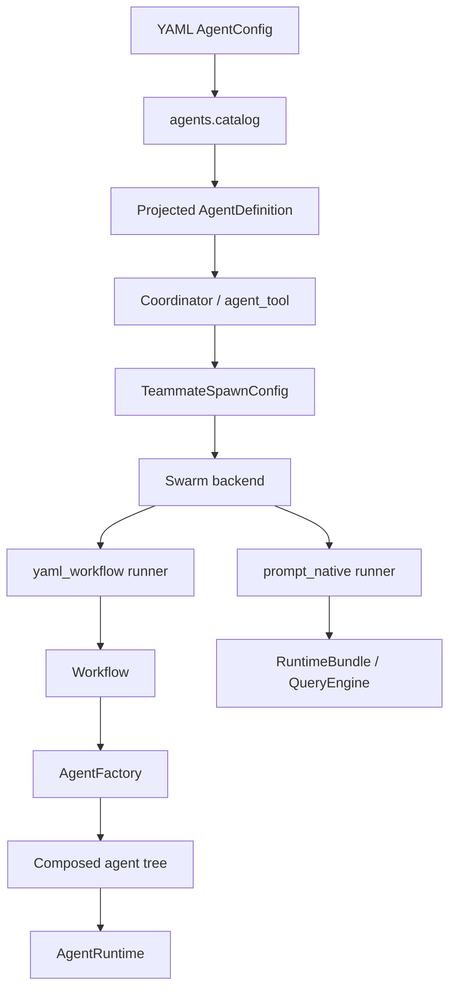
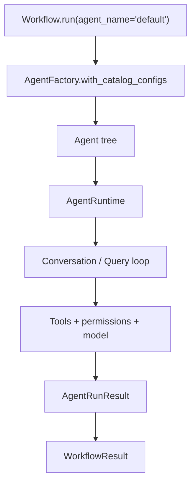
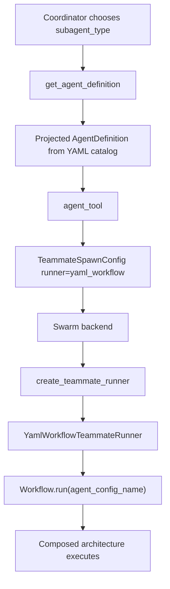
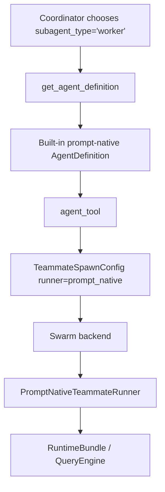

# Agent System

This document describes the current unified agent architecture in OpenHarness.

The codebase no longer has a separate "YAML agents system" and "upstream swarm system". It now has two explicit layers that meet through one shared contract:

- Control plane: `AgentDefinition`, coordinator mode, `agent` / `send_message`, swarm backends, mailbox delivery, permission sync, and worktree-aware spawning.
- Execution plane: `AgentConfig`, YAML architectures, `Workflow`, and `AgentRuntime`.

The key rule is:

- `AgentDefinition` is the public routing and deployment contract.
- `AgentConfig` is the private composition and execution contract.
- `runner` connects the two.

---

## Overview



There are now three ways an agent can appear in the catalog:

1. Built-in prompt-native definitions such as `worker`, `Explore`, `Plan`, and `verification`.
2. YAML-backed compositional agents projected into `AgentDefinition`.
3. Markdown or plugin-defined agents loaded directly as `AgentDefinition`.

Coordinator mode sees one merged catalog of all of them.

---

## Contracts

Everything builds on three core types in `agents.contracts`:

```text
TaskDefinition          what to do
  instruction: str      primary natural-language task
  payload: dict         extra variables forwarded to prompts / workflows

Agent (Protocol)        who does it
  run(task, runtime) -> AgentRunResult

AgentRunResult[T]       what came back
  output: T             str or structured Pydantic model
  input_tokens: int
  output_tokens: int
  final_text -> str
```

`Agent` is intentionally just a protocol. Any architecture can contain any other architecture as long as it implements `run(task, runtime)`.

---

## YAML Execution Model

`AgentConfig` in `agents.config` is the YAML execution model. It describes:

- `architecture`: `simple`, `planner_executor`, `reflection`, or `react`
- model and turn limits
- tool set
- prompt templates
- nested `subagents`
- optional `definition` metadata for coordinator and swarm projection

Minimal example:

```yaml
name: default
architecture: simple
description: Default compositional coding agent.
model: gemini-2.5-flash-lite
max_turns: 15
max_tokens: 8192

definition:
  subagent_type: yaml-default
  description: Composable YAML coding agent.
  runner: yaml_workflow
  color: cyan

tools:
  - bash
  - read_file
  - write_file
  - edit_file
  - glob
  - grep
  - agent
  - send_message
  - task_stop

prompts:
  system: |
    {{ openharness_system_context }}
    You are a coding agent.
  user: |
    {{ instruction }}
```

### `definition`

`definition` is the bridge into the control plane. It contains coordinator-visible metadata such as:

- `subagent_type`
- `description`
- `runner`
- `system_prompt` / `system_prompt_mode`
- `color`
- `permission_mode`
- `plan_mode_required`
- `allow_permission_prompts`
- `tools` / `disallowed_tools`
- `skills`
- `required_mcp_servers`
- `background`
- `initial_prompt`
- `isolation`

If `definition` is omitted, the system still projects the YAML config into an `AgentDefinition`, but it uses defaults derived from the YAML config itself.

---

## Catalogs

YAML configs are loaded from three locations:

1. Built-in: `src/openharness/agents/configs`
2. User: `~/.openharness/agent_configs`
3. Project: `.openharness/agent_configs`

Merge order is last-writer-wins by config name:

1. built-in
2. user
3. project

This merged catalog is used by:

- `AgentFactory.with_catalog_configs()`
- `Workflow`
- coordinator-side YAML projection into `AgentDefinition`
- Harbor wrapper setup

So there is now one shared YAML catalog, not separate loaders per subsystem.

---

## Coordinator Catalog

`coordinator.agent_definitions` produces the public agent catalog used by coordinator mode and swarm spawning.

The merged coordinator catalog is assembled in this order:

1. built-in prompt-native definitions
2. projected YAML-backed definitions
3. user markdown definitions from `~/.openharness/agents`
4. plugin-provided definitions

Important `AgentDefinition` fields include:

- `name`
- `description`
- `subagent_type`
- `runner`
- `agent_config_name`
- `agent_architecture`
- `system_prompt`
- `system_prompt_mode`
- `tools` / `disallowed_tools`
- `permission_mode`
- `permissions`
- `plan_mode_required`
- `allow_permission_prompts`
- `background`
- `isolation`

Lookup works by either definition `name` or `subagent_type`. In practice, `subagent_type` is the stable routing key the coordinator should use.

---

## Architectures

Architectures still provide the main execution value of our fork.

### `simple`

Leaf architecture. Delegates directly to `AgentRuntime.run_agent_config(...)`.

### `planner_executor`

Two-stage composition:

1. planner produces a structured plan
2. executor carries it out

### `reflection`

Worker plus critic loop:

1. worker proposes a solution
2. critic returns a structured verdict
3. retry until approved or attempts exhausted

### `react`

Think, Act, Observe loop:

1. thinker returns structured next action
2. actor executes with tools
3. observation is fed into the next step

The important point is that architecture logic stays in the execution plane. Coordinator mode does not need to understand the internals. It routes to a definition whose `runner` is `yaml_workflow`.

---

## Runtime

`AgentRuntime` in `runtime.session` is the execution substrate used by YAML architectures.

Responsibilities:

- resolve settings and provider clients
- build the runtime system prompt
- construct a tool registry
- enforce permissions
- create `Conversation` objects
- track usage
- log messages and stream events

Key APIs:

- `run_agent_config(config, task)`
- `run_agent_config(..., output_type=MyModel)`
- `create_conversation(config, task)`
- `build_result(output)`

`Workflow` in `runtime.workflow` is the top-level execution entry point for YAML agents. It:

1. loads the merged YAML catalog with `AgentFactory.with_catalog_configs(workspace.cwd)`
2. creates the requested agent tree
3. builds an `AgentRuntime`
4. runs the agent
5. returns `WorkflowResult(agent_result=...)`

This is the path used by the `yaml_workflow` runner.

---

## Tool Registries

There are two relevant tool-registry layers.

### `create_default_tool_registry(...)`

Used by interactive prompt-native sessions. It supports:

- allow and deny filtering
- MCP tools
- coordinator and swarm tools

### `WorkspaceToolRegistryFactory(...)`

Used by `AgentRuntime` for YAML architectures. It supports:

- workspace-bound tools such as `bash`, `read_file`, `write_file`, `glob`, and `grep`
- compatibility tools such as `agent`, `send_message`, and `task_stop`
- tool-name normalization so upstream aliases such as `Read` and `Edit` map to `read_file` and `edit_file`

This means YAML agents can now opt into coordinator and swarm delegation tools directly by listing them in `tools`.

---

## Coordinator To Swarm Flow

`coordinator_mode.py` now renders a dynamic catalog into the system prompt and user context. The coordinator is no longer hardcoded to always use `subagent_type="worker"`.

When it chooses an agent:

1. `agent_tool` resolves the `AgentDefinition` by `subagent_type`
2. it maps that definition into `TeammateSpawnConfig`
3. it selects a backend from the swarm registry
4. the backend starts a stateful teammate runner

The spawn config now carries the fields the backend actually needs:

- `runner`
- `agent_config_name`
- `agent_architecture`
- `system_prompt`
- `system_prompt_mode`
- `allowed_tools`
- `disallowed_tools`
- `permission_mode`
- `plan_mode_required`
- `allow_permission_prompts`
- `initial_prompt`
- `max_turns`
- `worktree_path`

`send_message` is transport-oriented. It does not care whether the target teammate is prompt-native or YAML-backed. It routes follow-up turns into the active runner through the same backend.

---

## Runner Types

`swarm.runner.create_teammate_runner(...)` dispatches by `TeammateSpawnConfig.runner`.

### `prompt_native`

Used for built-in prompt-oriented workers.

Path:

1. build a `RuntimeBundle`
2. configure model, cwd, tools, and permission mode
3. maintain conversation state across turns
4. execute each incoming message through the query engine

This is the closest match to upstream worker behavior.

### `yaml_workflow`

Used for compositional YAML agents.

Path:

1. build a `LocalWorkspace`
2. load the merged YAML catalog
3. create a `Workflow`
4. run the named `AgentConfig`
5. return final text and usage

This is where our fork adds composition and reusable architectures on top of upstream swarm orchestration.

### `harbor`

`harbor` exists in the contract and the Harbor wrapper uses the same YAML catalog, but swarm teammate execution does not yet instantiate Harbor-backed runners. Today this is a reserved integration point, not a fully wired swarm path.

---

## Messaging, Permissions, And Worktrees

The upstream multi-agent runtime contributes the operational layer:

- swarm backends: in-process and subprocess
- file-based teammate mailbox for leader/worker messaging
- permission sync between workers and the leader
- worktree-aware spawn configuration
- richer coordinator prompt generation and team lifecycle support

Our YAML layer builds on top of that rather than replacing it.

The separation is:

- upstream owns teammate transport, lifecycle, routing, and interactive coordination
- our fork owns compositional execution once a `yaml_workflow` teammate is running

---

## End-To-End Flows

### Standalone YAML workflow



### Coordinator spawning a YAML-backed agent



### Coordinator spawning a prompt-native worker



### In-process vs subprocess

Backends differ only in transport:

- `in_process`: runs the teammate runner inside the current Python process and exchanges follow-up work through the swarm mailbox.
- `subprocess`: serializes the spawn config, launches `python -m openharness.swarm.worker`, and routes follow-up turns over stdin.

Both eventually execute the same runner contract.

---

## Concrete Example

The repository now includes a runnable example at `examples/local_coordinator_swarm_fix_bug`.

That example demonstrates the real merged flow:

1. a project-local YAML config is placed in `.openharness/agent_configs`
2. that YAML config is projected into `AgentDefinition` with `subagent_type=coordinator-swarm-fixer`
3. the script resolves that definition exactly like coordinator mode would
4. it maps the definition into `TeammateSpawnConfig`
5. it spawns the teammate through the in-process swarm backend
6. it sends the bug-fix task over the leader-to-worker mailbox
7. the `yaml_workflow` runner executes a `planner_executor` architecture
8. the script verifies the edited file locally

The example YAML agent is:

```yaml
name: coordinator_swarm_example
architecture: planner_executor
definition:
  subagent_type: coordinator-swarm-fixer
  description: Example YAML planner/executor that coordinator mode can spawn through the swarm runtime.
  runner: yaml_workflow
  color: teal

subagents:
  planner:
    architecture: simple
    tools: []
  executor:
    architecture: simple
    tools:
      - bash
      - read_file
      - write_file
      - edit_file
      - glob
      - grep
      - agent
      - send_message
      - task_stop
```

This is the important pattern:

- the coordinator sees one routable `AgentDefinition`
- the YAML side still controls the internal composition
- the executor can opt into upstream swarm tools such as `agent` and `send_message`

That is how we get full advantage from upstream coordinator and swarm infrastructure while still keeping our own compositional value.

---

## Langfuse View

If Langfuse is configured, the merged agent system now emits nested observations that mirror the runtime boundaries.

Expected shape for a YAML-backed swarm teammate:

```text
OpenHarness Session
└── swarm.yaml_workflow_turn
    └── yaml_workflow
        └── architecture.planner_executor
            ├── planner_phase
            │   └── agent_config:planner
            │       └── OpenHarness Turn
            │           ├── OpenHarness Model Turn
            │           └── ...
            └── executor_phase
                └── agent_config:executor
                    └── OpenHarness Turn
                        ├── OpenHarness Model Turn
                        ├── write_file
                        ├── agent
                        └── send_message
```

Expected shape for a prompt-native teammate:

```text
OpenHarness Session
└── swarm.prompt_native_turn
    └── OpenHarness Turn
        ├── OpenHarness Model Turn
        ├── read_file
        └── bash
```

The important point is that Langfuse now shows:

- the swarm handoff
- the selected runner
- the YAML workflow boundary
- architecture phases such as planner vs executor, reflection attempts, or react steps
- model turns and tool calls inside each phase

This makes the control-plane to execution-plane transition visible instead of implicit.

---

## Practical Mental Model

When working on this system, use this mental model:

- Coordinator chooses which agent to run by `subagent_type`.
- `AgentDefinition` describes how that agent should be spawned.
- `runner` decides which execution substrate to use.
- `AgentConfig` describes how a YAML-backed agent is composed internally.
- `Workflow` and `AgentRuntime` do the actual work for compositional agents.
- Swarm backends, mailbox delivery, permission sync, and worktree handling stay below that line as the shared operational layer.

If those responsibilities stay separate, the architecture remains coherent.
