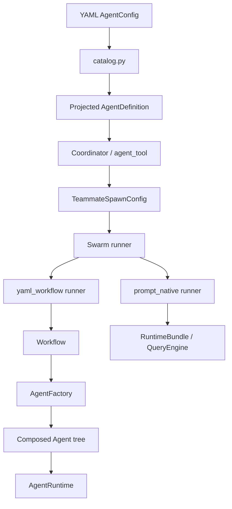
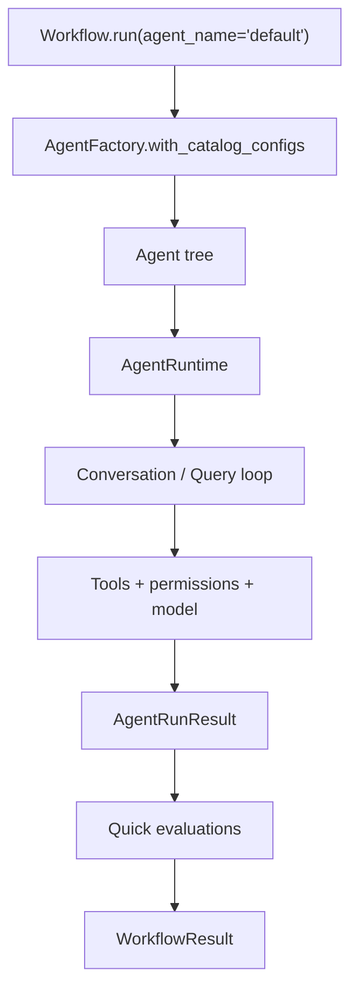
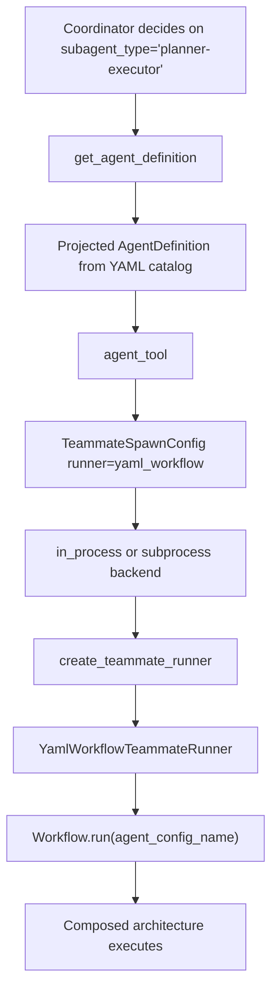
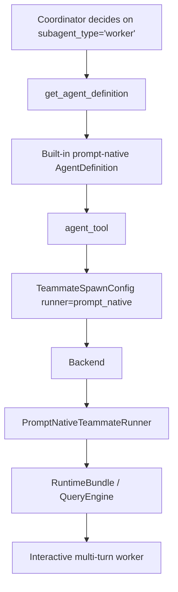

# Agent System

This document describes the current unified agent architecture in OpenHarness.

After the refactor, there is no longer a “YAML agents system” on one side and an unrelated “coordinator/swarm system” on the other. The code now has two explicit layers:

- Control plane: `AgentDefinition`, coordinator mode, `agent` / `send_message`, and swarm backends.
- Execution plane: `AgentConfig`, compositional architectures, `Workflow`, and `AgentRuntime`.

The key design rule is:

- `AgentDefinition` is the public routing and deployment contract.
- `AgentConfig` is the private composition and execution contract.

`runner` connects the two.

---

## Overview

At a high level:



There are now three ways an agent can exist:

1. Built-in prompt-native agents such as `worker`, `Explore`, `Plan`, and `verification`.
2. YAML-backed compositional agents projected into the coordinator catalog.
3. Markdown/plugin-defined agents loaded as `AgentDefinition`s.

Coordinator mode sees one merged catalog of all of them.

---

## Contracts — `agents.contracts`

Everything builds on three core types:

```text
TaskDefinition          what to do
  instruction: str      primary natural-language task
  payload: dict         extra variables forwarded to prompts / workflows

Agent (Protocol)        who does it
  run(task, runtime) -> AgentRunResult

AgentRunResult[T]       what came back
  output: T             str or structured Pydantic model
  input_tokens: int
  output_tokens: int
  final_text -> str
```

`Agent` is intentionally just a protocol. Any architecture can contain any other architecture as long as it implements `run(task, runtime)`.

---

## Configuration — `agents.config`

`AgentConfig` is the YAML execution model. It describes:

- `architecture`: `simple`, `planner_executor`, `reflection`, or `react`
- model and turn limits
- tool set
- prompt templates
- nested `subagents`
- optional `definition` metadata for coordinator/swarm projection
- optional `evaluations` for quick post-run assertions

Example:

```yaml
name: default
architecture: simple
description: Default compositional coding agent.
model: gemini-2.5-flash-lite
max_turns: 15
max_tokens: 8192

definition:
  subagent_type: yaml-default
  description: Composable YAML coding agent.
  runner: yaml_workflow
  color: cyan

tools:
  - bash
  - read_file
  - write_file
  - edit_file
  - glob
  - grep
  - agent
  - send_message
  - task_stop

evaluations:
  - name: no-traceback
    not_contains: "Traceback"

prompts:
  system: |
    {{ openharness_system_context }}
    You are a coding agent.
  user: |
    {{ instruction }}

subagents:
  planner: { ... }
  executor: { ... }
```

### `definition`

`definition` is the bridge into the control plane. It contains coordinator-visible metadata such as:

- `subagent_type`
- `description`
- `runner`
- `system_prompt` / `system_prompt_mode`
- `color`
- `permission_mode`
- `plan_mode_required`
- `allow_permission_prompts`
- `tools` / `disallowed_tools`
- `skills`
- `required_mcp_servers`
- `background`
- `initial_prompt`
- `isolation`

If `definition` is omitted, the system still projects the YAML config into an `AgentDefinition`, but it uses sensible defaults.

### `evaluations`

`evaluations` are lightweight assertions run after a YAML workflow completes. Today they support:

- `contains`
- `not_contains`

They are not a full benchmark harness. They are meant for cheap regression checks and policy assertions.

---

## Catalogs — `agents.catalog`

YAML configs are loaded from three locations:

1. Built-in: `src/openharness/agents/configs`
2. User: `~/.openharness/agent_configs`
3. Project: `.openharness/agent_configs`

Merge order is last-writer-wins by config name:

1. built-in
2. user
3. project

This merged catalog is used by:

- `AgentFactory.with_catalog_configs()`
- `Workflow`
- coordinator-side YAML projection into `AgentDefinition`
- Harbor wrapper setup

So there is now one shared YAML catalog, not separate loaders per subsystem.

---

## Coordinator Catalog — `coordinator.agent_definitions`

`AgentDefinition` is the public agent contract used by coordinator mode and swarm spawning.

The merged coordinator catalog is assembled in this order:

1. built-in prompt-native definitions
2. projected YAML-backed definitions
3. user markdown definitions from `~/.openharness/agents`
4. plugin-provided definitions

Important fields on `AgentDefinition` now include:

- `name`
- `description`
- `subagent_type`
- `runner`
- `agent_config_name`
- `agent_architecture`
- `system_prompt`
- `system_prompt_mode`
- `tools` / `disallowed_tools`
- `permission_mode`
- `permissions`
- `plan_mode_required`
- `allow_permission_prompts`

Lookup works by either:

- definition `name`
- or `subagent_type`

That makes `subagent_type` the stable routing key the coordinator should use.

---

## Architectures — `agents.architectures`

Architectures still provide the main execution value of our fork.

### `simple`

Leaf architecture. Delegates directly to `AgentRuntime.run_agent_config(...)`.

### `planner_executor`

Two-stage composition:

1. planner produces a structured plan
2. executor carries it out

### `reflection`

Worker + critic loop:

1. worker proposes a solution
2. critic returns a structured verdict
3. retry until approved or attempts exhausted

### `react`

Think / Act / Observe loop:

1. thinker returns structured next action
2. actor executes with tools
3. observation is fed into the next step

The important point is that architecture logic stays in the execution plane. Coordinator mode does not need to understand any of this internals. It just routes to a definition whose `runner` is `yaml_workflow`.

---

## Runtime — `runtime.session`

`AgentRuntime` is the execution substrate used by YAML architectures.

Responsibilities:

- resolve settings and provider clients
- build the runtime system prompt
- construct a tool registry
- enforce permissions
- create `Conversation` objects
- track usage
- log messages and stream events

Key APIs:

- `run_agent_config(config, task)`
- `run_agent_config(..., output_type=MyModel)`
- `create_conversation(config, task)`
- `build_result(output)`

`AgentRuntime` is used by architecture code. It is not the coordinator-facing contract.

---

## Workflow — `runtime.workflow`

`Workflow` is the entry point for YAML-backed agent execution.

It now:

1. loads the merged YAML catalog with `AgentFactory.with_catalog_configs(workspace.cwd)`
2. creates the requested agent tree
3. builds an `AgentRuntime`
4. runs the agent
5. executes configured quick evaluations

```python
wf = Workflow(workspace)
result = await wf.run(
    TaskDefinition(instruction="Fix the bug"),
    agent_name="default",
)
```

`WorkflowResult` contains:

- `agent_result`
- `evaluation`

This is the execution path used by the `yaml_workflow` runner.

---

## Tool Registries — `tools`

There are now two relevant tool-registry layers:

### `create_default_tool_registry(...)`

Used by interactive prompt-native sessions. It supports:

- allow/deny filtering
- MCP tools
- coordinator/swarm tools

### `WorkspaceToolRegistryFactory(...)`

Used by `AgentRuntime` for YAML architectures. It now supports:

- workspace-bound tools like `bash`, `read_file`, `write_file`, `glob`, `grep`
- compatibility tools like `agent`, `send_message`, and `task_stop`
- tool-name normalization so upstream aliases such as `Read` and `Edit` map to `read_file` and `edit_file`

This means YAML agents can now opt into coordinator/swarm delegation tools directly by listing them in `tools`.

---

## Coordinator And Swarm

### Coordinator prompt generation

`coordinator_mode.py` now renders a dynamic agent catalog into the system prompt and user context. The coordinator is no longer told to always use `subagent_type="worker"`.

Instead it sees the current available catalog and chooses from:

- built-in prompt-native agents
- YAML-projected compositional agents
- markdown/plugin agents

### `agent_tool`

`agent_tool` is the main bridge from coordinator to execution.

Flow:

1. resolve `AgentDefinition` by `subagent_type`
2. map it into `TeammateSpawnConfig`
3. choose a backend
4. spawn a teammate

The spawn config now carries the fields the backend actually needs:

- `runner`
- `agent_config_name`
- `agent_architecture`
- `system_prompt`
- `system_prompt_mode`
- `allowed_tools`
- `disallowed_tools`
- `permission_mode`
- `plan_mode_required`
- `allow_permission_prompts`
- `initial_prompt`
- `max_turns`

### `send_message`

`send_message` stays transport-oriented. It does not care whether the target teammate is prompt-native or YAML-backed. It routes follow-up turns into the active runner.

---

## Runner Types — `swarm.runner`

`TeammateSpawnConfig.runner` selects the execution substrate.

### `prompt_native`

Used for built-in prompt-oriented workers.

Path:

1. build a `RuntimeBundle`
2. configure model, cwd, tools, and permission mode
3. maintain conversation state across turns
4. execute each incoming message through the query engine

This is the closest match to upstream worker behavior.

### `yaml_workflow`

Used for compositional YAML agents.

Path:

1. build a `LocalWorkspace`
2. load the merged YAML catalog
3. create a `Workflow`
4. run the named `AgentConfig`
5. return final text plus evaluation metadata

This is where our fork’s extra value lives: composition, architectures, structured intermediate steps, and quick evaluations.

### `harbor`

`harbor` exists in the model as a runner type and `OpenHarnessHarborAgent` uses the same catalog, but swarm teammate execution does not yet instantiate Harbor-backed runners. Today this is a reserved integration point, not a fully wired swarm path.

---

## End-To-End Flows

### 1. Standalone YAML workflow



This is the path used by direct workflow execution and by the YAML teammate runner.

### 2. Coordinator spawning a YAML-backed agent



This is the main new integration path created by the refactor.

### 3. Coordinator spawning a prompt-native worker



This preserves upstream-style workers while using the same swarm transport and spawn contract as YAML agents.

### 4. In-process vs subprocess

Backends differ only in transport:

- `in_process`: runs the teammate runner directly inside the current Python process and uses mailbox delivery for follow-up turns.
- `subprocess`: serializes the spawn config to disk, starts `python -m openharness.swarm.worker`, and feeds follow-up turns over stdin.

Both eventually execute the same runner contract.

---

## Composition

Compositionality is still the main advantage of the YAML layer.

Example:

```yaml
name: nested_example
architecture: planner_executor
subagents:
  planner:
    architecture: simple
    tools: []
  executor:
    architecture: reflection
    subagents:
      worker:
        architecture: simple
        tools: [bash, write_file, agent]
      critic:
        architecture: simple
        tools: []
```

This gives us:

- reusable agent trees
- architecture-specific behavior
- structured intermediate contracts
- optional recursive delegation through `agent` / `send_message`
- cheap workflow-level evaluations

That is the additional value we layer on top of upstream’s coordinator and swarm runtime.

---

## Practical Mental Model

When working on this system, use this mental model:

- Coordinator chooses *which* agent to run by `subagent_type`.
- `AgentDefinition` describes *how that agent should be spawned*.
- `runner` decides *which execution substrate* to use.
- `AgentConfig` describes *how a YAML-backed agent is composed internally*.
- `Workflow` and `AgentRuntime` do the actual work for compositional agents.

If you keep those responsibilities separate, the architecture stays coherent.
