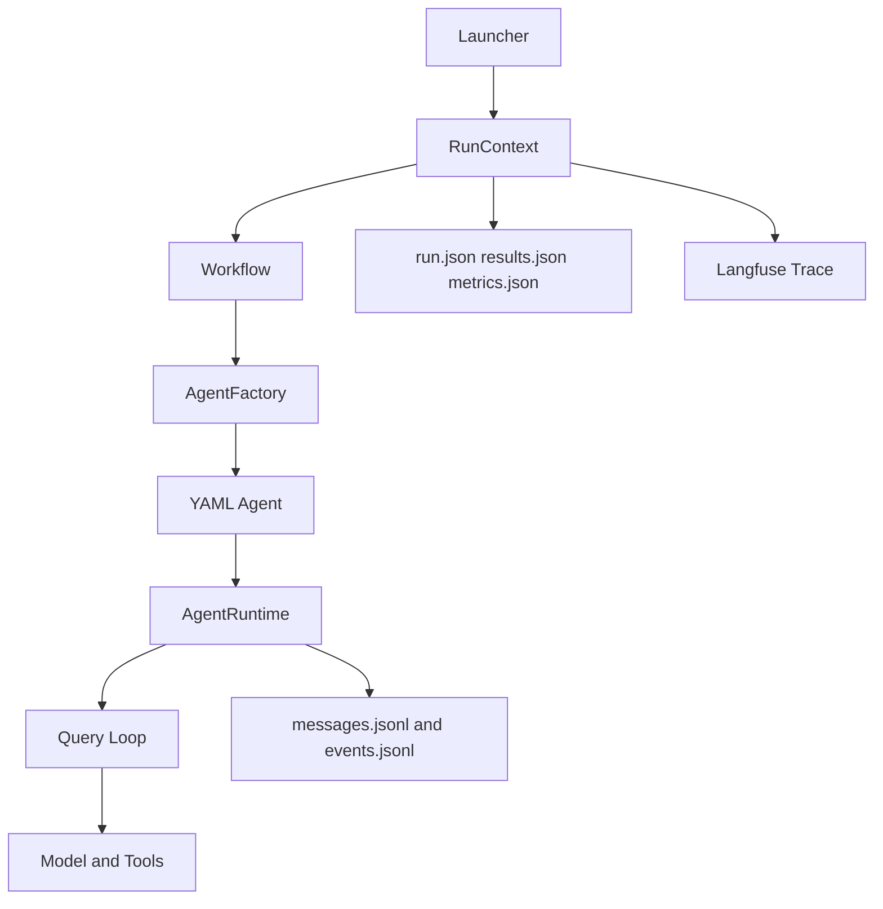
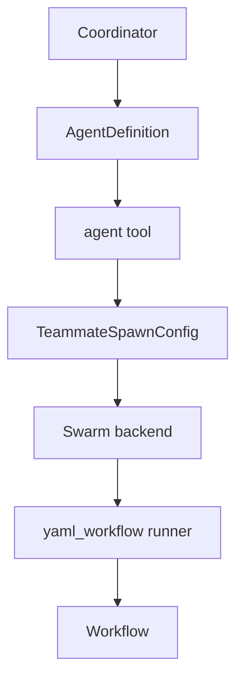
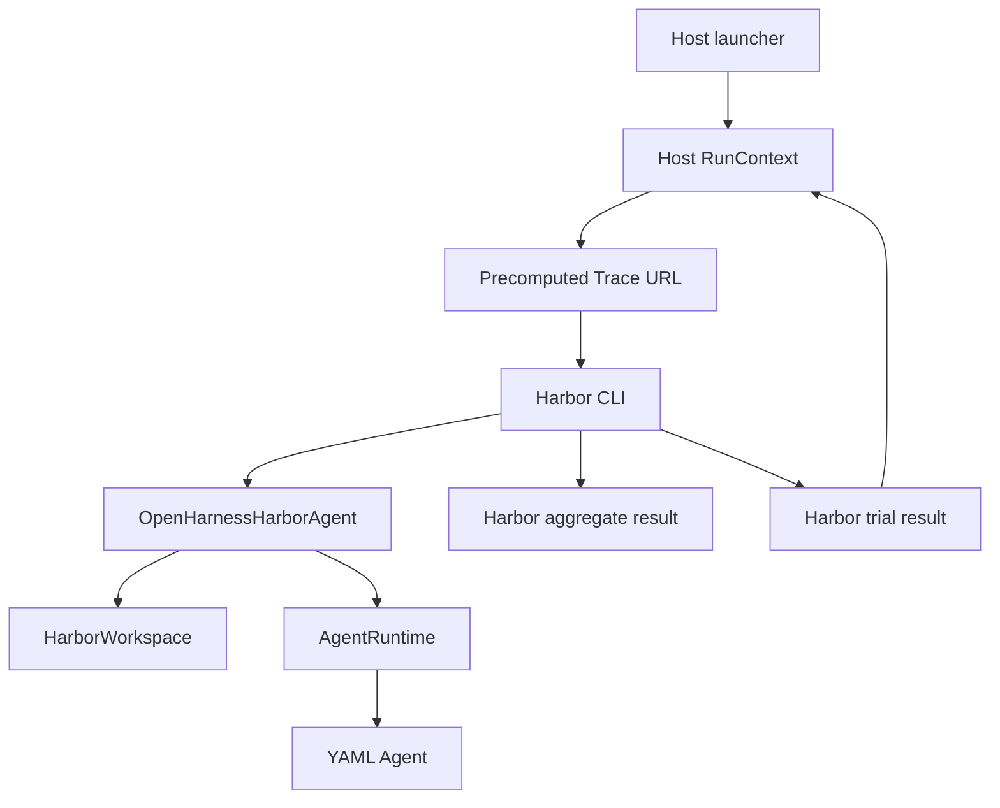

# Architecture

The architecture has two main planes.

```text
control plane:   upstream routing, coordination, tools, permissions
execution plane: fork YAML runtime, run artifacts, traces, Harbor bridge
```

The control plane decides what should run. The execution plane decides how a YAML-backed agent runs and how the run is recorded.

## Boundary

Upstream-owned responsibilities:

- CLI and interactive runtime
- coordinator mode
- `AgentDefinition`
- `agent` and `send_message` tools
- swarm backends and mailboxes
- permission sync and worktree-aware spawning
- skills, plugins, hooks, MCP, and tool conventions

Fork-owned responsibilities:

- YAML `AgentConfig`
- `AgentFactory`
- `Workflow`
- `AgentRuntime`
- run artifacts and `RunContext`
- Langfuse `TraceObserver`
- Google Gemini and Vertex AI client support
- Harbor adapter and runner utilities

## Local YAML Run



Path:

1. launcher generates `run_id`
2. launcher creates `runs/<run_id>/workspace`
3. `RunContext` owns artifact paths
4. `Workflow` loads the project YAML catalog
5. `AgentFactory` creates the configured agent
6. `AgentRuntime` runs model/tool turns
7. artifacts and trace metadata are written under `runs/<run_id>/`

## YAML Catalog

Catalog sources:

1. built-in configs in `src/openharness/agents/configs`
2. user configs in `~/.openharness/agent_configs`
3. project configs in `.openharness/agent_configs`

Project configs override user configs, and user configs override built-ins.

The same catalog is used by:

- local `Workflow`
- high-level `run_local_agent(...)`
- coordinator projection
- Harbor agent adapter

## Runtime System Context

YAML prompts can include:

```jinja2
{{ openharness_system_context }}
```

`AgentRuntime._prepare_query(...)` supplies that value. It injects the shared OpenHarness runtime contract: workspace expectations, tool-use behavior, safety rules, and project context.

YAML configs should use the variable instead of copying the base system prompt into every config.

## Coordinator To YAML Worker



Bridge points:

- YAML configs can define coordinator-facing metadata under `definition`.
- If `definition` is missing, defaults are projected from the config.
- The `runner` field selects the execution substrate.
- `yaml_workflow` runs through the fork's `Workflow`.

## Workflow Team

The workflow example uses:

```text
TeamOrchestrator
worker_a
worker_b
inline coordinator
shared RunContext
shared TraceObserver
```

The workers are persistent mailbox participants. The coordinator runs inline and can coordinate through mailboxes. All of them share the same run ID and trace.

## Harbor Run



Important details:

- host-side artifacts live in `runs/<run_id>/`
- Harbor job output lives under `runs/<run_id>/harbor_jobs/`
- the aggregate Harbor result stores stats
- the per-trial Harbor result stores agent metadata
- trace URL is read back from the trial result after Harbor completes

## Trace Model

The Langfuse span hierarchy is intentionally small:

```text
session
└── agent:<name>
    ├── model
    ├── tool:<name>
    └── ...
```

For stateful swarm teammates:

```text
session
└── turn
    └── agent:<name>
        ├── model
        └── tool:<name>
```

The trace should show useful control-flow boundaries, not every helper function.

## Design Rules

- Keep coordinator routing independent from YAML implementation details.
- Keep run identity in `RunContext`.
- Keep trace identity in `TraceObserver`, mirrored into `RunContext`.
- Use YAML configs for agent behavior, not ad hoc launcher prompts.
- Add Harbor features through specs and the adapter, not by special-casing examples.
